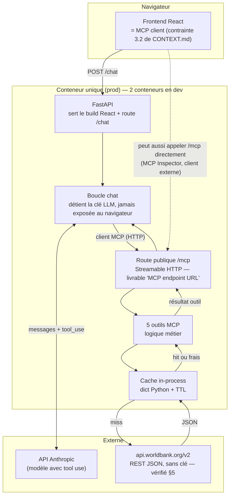

# Spécification — Tableau de bord Côte d'Ivoire (serveur MCP + chat)

> **`CONTEXT.md` prévaut sur ce document en cas de conflit** — c'est le contexte
> de l'assessment Liwaza (barème, contraintes dures, historique de décisions). Ce
> fichier a été mis à jour le 2026-08-05 pour intégrer ses corrections : transport
> MCP en HTTP public (§3.3 de CONTEXT.md, remplace l'ancien §6.3 ci-dessous), pas
> de contrainte géospatiale (§5.1 de CONTEXT.md, remplace l'ancien §6.2), et les
> vérifications curl du §6 de CONTEXT.md.
>
> Statut : cadrage validé sur les points bloquants, prêt pour l'implémentation.
> Budget : ~5h dont ~4h de construction (cf. plan §8) — **à re-questionner** : le
> barème réel (CONTEXT.md §2, 7 catégories notées) est plus large que ce que 5h
> permettent de bien traiter. Voir note en fin de document.

---

## 1. Objectif

Construire un serveur MCP exposant 5 outils qui interrogent l'API REST de la Banque
mondiale (`api.worldbank.org`), branché à une boucle de chat (LLM + tool use), avec
un frontend minimal, dockerisé, déployé publiquement.

Le projet démontre — pas la richesse des données, mais la **chaîne complète** :
source externe → outils typés → orchestration LLM → interface → déploiement.
L'outil `compare_countries` porte la charge démonstrative : c'est la seule réponse
qu'un utilisateur ne peut pas obtenir en une requête manuelle sur le site de la
Banque mondiale.

---

## 2. Architecture schématisée



**Pourquoi un seul conteneur en prod** : FastAPI sert le `build/` React comme fichiers
statiques (`StaticFiles`), donc un seul process, un seul déploiement. Le
`docker-compose.yml` à deux services (frontend dev-server + backend) reste pour le
confort de développement local et satisfait le livrable "CI/CD + Docker" sans
complexifier la prod.

**Pourquoi `/mcp` en HTTP et pas en `stdio`** (décision de CONTEXT.md §3.3, tranche
l'ancien point ouvert §6.3 de ce document) : l'énoncé exige une « MCP endpoint URL »
livrable et joignable par l'évaluateur. Un transport `stdio` n'a pas d'URL — il
n'aurait rien à livrer. La route `/mcp` tourne dans le même process que `/chat`
(pas de service séparé, pas de coût architectural supplémentaire), mais elle est
montée en Streamable HTTP et donc testable indépendamment avec MCP Inspector.
La boucle `/chat` s'y connecte elle-même comme client MCP plutôt que d'importer
les fonctions Python directement — c'est ce qui fait que le frontend "MCP client"
et la contrainte 3.2 (logique métier dans le serveur MCP, jamais contournée) sont
respectés à la fois par le chat et par un client externe.

---

## 3. Flux d'une requête utilisateur

```mermaid
sequenceDiagram
    actor U as Utilisateur
    participant UI as Frontend (MCP client)
    participant API as FastAPI /chat
    participant LLM as Claude (tool use)
    participant MCPH as /mcp (HTTP public)
    participant T as Outil compare_countries
    participant WB as World Bank API

    U->>UI: "Compare l'inflation CI/Ghana/Sénégal"
    UI->>API: POST /chat {message, historique}
    API->>LLM: messages + définitions des 5 outils (via /mcp)
    LLM-->>API: tool_use(compare_countries, {...})
    API->>MCPH: appel MCP (client interne, HTTP)
    MCPH->>T: compare_countries(indicator_id, country_codes)
    T->>WB: GET /country/civ;gha;sen/indicator/...?mrv=1
    Note over T,WB: vérifié par curl le 2026-08-05 — voir §5
    WB-->>T: JSON
    T-->>MCPH: résultat structuré
    MCPH-->>API: tool_result
    API->>LLM: tool_result
    LLM-->>API: réponse texte finale
    API-->>UI: réponse
    UI-->>U: affichage
```

---

## 4. Les 5 outils MCP — spécification détaillée

Convention commune : chaque outil retourne du JSON structuré (jamais du texte libre)
pour que le LLM puisse le reformuler ; les erreurs de l'API World Bank (qui renvoie
un objet `{"message": [...]}` au lieu d'un tableau quand un code est invalide)
doivent être interceptées et transformées en erreur d'outil lisible.

### 4.1 `search_indicators`

Trouver un ou plusieurs indicateurs par mot-clé, sans que l'utilisateur connaisse le
code exact (ex. "pauvreté" → `SI.POV.DDAY`).

```json
{
  "name": "search_indicators",
  "description": "Recherche des indicateurs de la Banque mondiale par mot-clé (français ou anglais approximatif).",
  "inputSchema": {
    "type": "object",
    "properties": {
      "query": { "type": "string", "description": "Mot-clé, ex. 'inflation', 'poverty', 'internet'" },
      "limit": { "type": "integer", "default": 10, "minimum": 1, "maximum": 50 }
    },
    "required": ["query"]
  }
}
```

- **Implémentation** : la Banque mondiale n'a pas d'endpoint de recherche full-text
  côté serveur. On télécharge une fois `GET /v2/indicator?format=json&per_page=25000`
  (~20 000 entrées), on le garde en cache mémoire (chargé au démarrage ou paresseux
  au premier appel), et on filtre côté Python (`query.lower() in name.lower() or in
  sourceNote.lower()`).
- **Retour** : `[{indicator_id, name, source_note_tronquee, topics}]`
- **Point à vérifier avant de coder** : confirmer le `per_page` maximal réel de
  l'API (documenté historiquement autour de 32 500, mais à re-tester — un dépassement
  renvoie une erreur qu'il faut gérer par pagination si besoin).

### 4.2 `get_indicator_series`

Série temporelle d'un indicateur pour un pays (Côte d'Ivoire par défaut).

```json
{
  "name": "get_indicator_series",
  "description": "Série temporelle d'un indicateur pour un pays donné (Côte d'Ivoire par défaut).",
  "inputSchema": {
    "type": "object",
    "properties": {
      "indicator_id": { "type": "string", "description": "Code Banque mondiale, ex. NY.GDP.MKTP.CD" },
      "country_code": { "type": "string", "default": "CIV", "description": "Code ISO3, ex. CIV, GHA, SEN" },
      "start_year": { "type": "integer" },
      "end_year": { "type": "integer" }
    },
    "required": ["indicator_id"]
  }
}
```

- **Endpoint** :
  `GET /v2/country/{country_code}/indicator/{indicator_id}?date={start}:{end}&format=json&per_page=1000`
- **Retour** : `{country, indicator_name, unit, series: [{year, value}], source}`
  (filtrer les `value: null`, les signaler séparément plutôt que les faire
  disparaître silencieusement).
- **Cache key** : `(country_code, indicator_id, start_year, end_year)`, TTL 24h
  (les données macro ne changent pas dans la journée).

### 4.3 `get_latest_value`

Dernière valeur connue d'un indicateur — utile car les séries ont souvent 1-2 ans
de retard et l'utilisateur veut "la valeur actuelle", pas la dernière année civile.

```json
{
  "name": "get_latest_value",
  "description": "Dernière valeur disponible d'un indicateur pour un pays (gère les années manquantes).",
  "inputSchema": {
    "type": "object",
    "properties": {
      "indicator_id": { "type": "string" },
      "country_code": { "type": "string", "default": "CIV" }
    },
    "required": ["indicator_id"]
  }
}
```

- **Endpoint** : `GET /v2/country/{country_code}/indicator/{indicator_id}?format=json&mrv=1`
  — le paramètre `mrv=1` ("most recent value") fait sauter côté serveur les années
  à `null`, évite de reconstruire cette logique en Python. **Ne pas dupliquer**
  `get_indicator_series` avec un `mrv=1` en interne : autant appeler cet endpoint
  directement, c'est plus simple et plus fiable.
- **Retour** : `{country, indicator_name, year, value, unit}`

### 4.4 `compare_countries`

Le cœur démonstratif du projet.

```json
{
  "name": "compare_countries",
  "description": "Compare la valeur la plus récente d'un indicateur entre plusieurs pays.",
  "inputSchema": {
    "type": "object",
    "properties": {
      "indicator_id": { "type": "string" },
      "country_codes": {
        "type": "array",
        "items": { "type": "string" },
        "minItems": 2,
        "maxItems": 6,
        "default": ["CIV", "GHA", "SEN"]
      }
    },
    "required": ["indicator_id"]
  }
}
```

- **Endpoint** : la Banque mondiale accepte plusieurs codes pays séparés par `;`
  dans un seul appel : `GET /v2/country/civ;gha;sen/indicator/{id}?format=json&mrv=1`
  → **un seul round-trip réseau**, pas une boucle de N appels. C'est le détail qui
  rend cet outil élégant à implémenter.
- **Retour** : `{indicator_name, year_used, values: [{country, value}], classement}`
  — si les pays n'ont pas tous leur "most recent" à la même année (fréquent), le
  signaler explicitement plutôt que de comparer silencieusement des années
  différentes.
- **Codes utiles pour les comparateurs par défaut** : Ghana `GHA`, Sénégal `SEN`,
  Nigeria `NGA`, agrégat régional Afrique subsaharienne `SSF` ou `SSA` (à vérifier
  lequel des deux codes d'agrégat la Banque mondiale utilise actuellement).

### 4.5 `list_topics`

Aide à la découverte : liste les grandes thématiques disponibles, pour que le LLM
puisse orienter l'utilisateur ("santé", "éducation", "environnement"...).

```json
{
  "name": "list_topics",
  "description": "Liste les thématiques d'indicateurs disponibles à la Banque mondiale.",
  "inputSchema": { "type": "object", "properties": {} }
}
```

- **Endpoint** : `GET /v2/topic?format=json`
- **Retour** : `[{topic_id, name, source_note}]`
- Peu coûteux, peu de raison de le cacher au-delà d'un chargement au démarrage.

---

## 5. Ressources disponibles (API Banque mondiale)

- **Base URL** : `https://api.worldbank.org/v2/`
- **Format** : ajouter `format=json` à chaque requête (XML par défaut sinon).
- **Pas de clé API, pas de quota documenté agressif** — c'est la raison du
  changement de source depuis Overpass/OSM.
- **Endpoints mobilisés** :
  | Usage | Endpoint |
  |---|---|
  | Liste complète des indicateurs | `/indicator?format=json&per_page=25000` |
  | Série pays × indicateur | `/country/{iso3}/indicator/{code}?format=json&date=Y1:Y2` |
  | Dernière valeur | `/country/{iso3}/indicator/{code}?format=json&mrv=1` |
  | Multi-pays en un appel | `/country/{iso3a};{iso3b};.../indicator/{code}?format=json&mrv=1` |
  | Thématiques | `/topic?format=json` |
  | Indicateurs par thème (bonus, non retenu dans les 5 outils) | `/topic/{id}/indicator?format=json` |
- **Forme de la réponse** : un tableau `[metadata, data]` où `metadata` contient
  `{page, pages, per_page, total}` et `data` contient les enregistrements. **Cas
  d'erreur** : si le code pays ou indicateur est invalide, l'API renvoie un objet
  `{"message": [{"id": ..., "key": "...", "value": "..."}]}` au lieu du tableau
  attendu — à détecter explicitement (`isinstance(data, dict)`), sinon crash
  silencieux sur un `data[1]` qui n'existe pas.
- **Code pays cible** : Côte d'Ivoire = `CIV`.
- **Indicateurs pressentis pour peupler des exemples / tests** :
  `NY.GDP.MKTP.CD` (PIB), `NY.GDP.MKTP.KD.ZG` (croissance PIB), `SP.POP.TOTL`
  (population), `FP.CPI.TOTL.ZG` (inflation), `SL.UEM.TOTL.ZS` (chômage),
  `SI.POV.DDAY` (pauvreté extrême), `SP.DYN.LE00.IN` (espérance de vie),
  `IT.NET.USER.ZS` (usage internet).

### 5.1 Vérifications empiriques du 2026-08-05

Conformément à CONTEXT.md §4 et §6 (interdiction de présenter une supposition comme
un fait), chaque hypothèse a été testée par curl avant d'être admise dans ce
document. Tableau de CONTEXT.md §6 mis à jour :

| Affirmation | Statut avant | Statut après vérification (2026-08-05) |
|---|---|---|
| `api.worldbank.org` répond sans clé | Non testé | **Vérifié** — `HTTP 200` sur `/country/CIV/indicator/NY.GDP.MKTP.CD?mrv=1` |
| Multi-pays en un appel via `civ;gha;sen` | Supposé | **Vérifié** — un seul appel `/country/civ;gha;sen/indicator/FP.CPI.TOTL.ZG?mrv=1` retourne les 3 pays |
| Forme exacte de l'erreur sur code invalide | Supposé | **Vérifié** — `{"message":[{"id":"120","key":"Invalid value","value":"..."}]}` |
| `per_page` maximal de `/indicator` | Supposé (~25 000) | **Corrigé** — `per_page=30000` fonctionne en une page ; total réel = **29 544** indicateurs (pas ~20 000) |
| Code d'agrégat Afrique subsaharienne | Supposé (`SSF` ou `SSA`) | **Vérifié — les deux existent, ce sont deux agrégats différents** : `SSF` = "Sub-Saharan Africa" (tous les pays), `SSA` = "Sub-Saharan Africa (excluding high income)". Retenir `SSF` par défaut pour une comparaison régionale générale. |

Commandes utilisées (reproductibles, à inclure telles quelles dans le README comme
preuve d'exécution réelle — CONTEXT.md §3.1) :

```bash
curl -s "https://api.worldbank.org/v2/country/CIV/indicator/NY.GDP.MKTP.CD?format=json&mrv=1"
curl -s "https://api.worldbank.org/v2/country/civ;gha;sen/indicator/FP.CPI.TOTL.ZG?format=json&mrv=1"
curl -s "https://api.worldbank.org/v2/country/XX/indicator/NOPE.CODE?format=json"
curl -s "https://api.worldbank.org/v2/indicator?format=json&per_page=30000"
curl -s "https://api.worldbank.org/v2/country/SSF?format=json"
```

---

## 6. Ce qu'il reste à comprendre / décisions à trancher avant de coder

Les anciens points 1 à 3 de cette section sont **tranchés** par `CONTEXT.md` et ne
sont plus ouverts :

- ~~Deadline du 10 juin~~ → sans objet, ce document répond à un assessment
  Liwaza sans deadline fixe communiquée dans `CONTEXT.md` ; à reconfirmer
  directement avec l'énoncé si une date y figure.
- ~~Contrainte géospatiale~~ → **résolue, non requise** (CONTEXT.md §5.1) : la
  Banque mondiale est un choix valide, la disjonction de l'énoncé ("une API
  documentée **ou** publiquement accessible") est satisfaite, et les données
  tabulaires macro sont explicitement recevables.
- ~~Transport MCP stdio vs HTTP~~ → **tranché en HTTP public** (CONTEXT.md §3.3,
  cf. §2 ci-dessus) : c'est une contrainte dure du livrable, pas un choix de
  confort.

Restent ouverts (CONTEXT.md §7) :

1. **Cible de déploiement public** : Render, Fly.io, Railway ou VPS existant ?
   Change le Dockerfile et la section "0h30 déploiement" du plan §8.
2. **Modèle LLM retenu** et porteur du coût de la clé en déploiement public
   (rate limiting obligatoire sur `/chat`, CONTEXT.md §3.4).
3. **data.gouv.ci comme couche ivoirienne complémentaire** (CONTEXT.md §5.4) :
   non vérifié à ce stade que `/api/v1/datasets` répond sans clé. À tester par
   curl si le budget temps le permet, mais **jamais présenté comme fonctionnel
   avant test** — même règle qu'au §5.1.

---

## 7. Stack et arborescence proposée

```
liwaza-dashboard/
├── docker-compose.yml            # dev local : frontend + backend séparés
├── backend/
│   ├── Dockerfile                # prod : sert aussi le build React en statique
│   ├── pyproject.toml
│   ├── app/
│   │   ├── main.py               # FastAPI : StaticFiles + route /chat + montage /mcp
│   │   ├── mcp_server.py         # déclaration des 5 outils, transport Streamable HTTP
│   │   ├── worldbank_client.py   # requêtes HTTP + parsing + gestion erreurs
│   │   ├── cache.py              # dict + TTL, clé = tuple des params
│   │   └── chat_loop.py          # boucle LLM, se connecte à /mcp comme client MCP (pas d'import direct)
│   └── tests/
│       └── test_tools.py         # 2-3 tests sur la couche outils (cf. §9)
├── frontend/
│   └── src/…                     # chat minimal, appelle POST /chat
└── docs/
    ├── SPEC_MCP_COTE_IVOIRE.md   # ce fichier
    ├── architecture.md           # doc archi condensée (livrable)
    └── ai_strategy.md            # doc stratégie IA (livrable)
```

---

## 8. Plan d'exécution (5h, rappel affiné)

| Étape | Durée | Détail |
|---|---|---|
| Scaffold + Dockerfile + compose | 0h30 | arborescence ci-dessus, healthcheck basique |
| Client World Bank + cache | 0h30 | `worldbank_client.py`, gestion de l'erreur `{"message": ...}` |
| 5 outils MCP | 1h00 | signatures §4, tests manuels via curl avant de brancher le LLM |
| Boucle `/chat` | 0h30 | tool use, gestion multi-tours |
| Frontend chat minimal | 1h00 | input + historique + affichage réponse |
| Déploiement mono-service | 0h30 | build React → static, un seul conteneur |
| README + doc archi condensée | 0h45 | 2 pages, inclut les sacrifices assumés (§9) |
| Vidéo | 0h45 | démo `compare_countries` en priorité, c'est l'outil qui vend le projet |

---

## 9. Ce qui est sacrifié, assumé par écrit

- **Tests** : 2-3 tests unitaires sur `worldbank_client.py` (parsing, détection
  d'erreur), pas de couverture sur le frontend ni sur la boucle LLM. Section dédiée
  dans le README expliquant pourquoi (contrainte de temps, la couche à risque —
  parsing d'une API externe — est celle qui est testée).
- **Frontend** : fonctionnel et sobre, pas de polish visuel.
- **Cache** : dictionnaire Python in-process, pas Redis. Limite explicitement
  documentée : incohérent dès plusieurs réplicas, à remplacer par Redis au premier
  besoin de scaling horizontal.
- **Doc archi** : 2 pages denses plutôt qu'une doc exhaustive.

---

## 10. Prochaine étape

Les vérifications curl du §5.1 sont faites — plus rien ne bloque le début du code.
Reste à trancher les 3 points du §6 (déploiement, modèle LLM, data.gouv.ci en
option) avant d'écrire `main.py`, mais aucun n'invalide l'architecture : ce sont
des paramètres, pas des remises en cause.

## 11. Tension budget vs barème réel — à arbitrer avec l'utilisateur

Le plan §8 (5h, ~4h de construction) a été conçu avant la lecture de `CONTEXT.md`.
Le barème réel (CONTEXT.md §2) note 7 catégories, dont trois à 15 % chacune
(Frontend, Backend, MCP Design) plus DevOps, Testing, AI Agent Orchestration et
Documentation — en plus des 20 % d'Engineering Reasoning déjà couverts par ce
document et par l'historique de décision du §5. Le plan à 5h reste jouable pour
produire *quelque chose* dans chaque catégorie, mais les arbitrages du §9
(tests réduits à 2-3, frontend sobre) sont désormais **alignés avec CONTEXT.md
§8** ("coupable sans regret" pour les tests et le polish) — donc défendables,
pas un compromis honteux. Le point à trancher avec l'utilisateur n'est pas
technique : est-ce que 5h est le budget réel disponible, ou une contrainte de
départ à revisiter maintenant que le barème complet est connu ?
