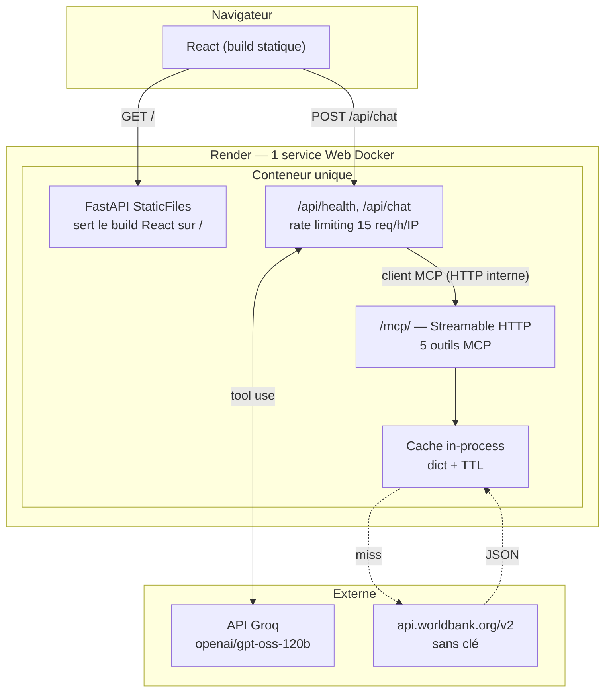

# Architecture — Tableau de bord Côte d'Ivoire

> Diagrammes, topologie de déploiement, flux de données, et plan de
> scalabilité. Pour le *pourquoi* de chaque décision, voir les notes de
> cadrage internes de l'assessment (`CONTEXT.md`, non versionnées) — ce
> document se concentre sur le *comment*.

---

## 1. Vue d'ensemble

Trois couches, une seule contrainte non négociable : la logique métier vit
dans le serveur MCP, jamais dans le frontend ni contournée par lui
(CONTEXT.md §3.2).

```
React (client MCP) → /api/chat (orchestration) → client MCP interne (HTTP)
                                                        ↓
                                                    /mcp/ (5 outils)
                                                        ↓
                                              api.worldbank.org (REST/JSON)
```

Le frontend est lui-même un client MCP au sens de l'énoncé, mais il ne parle
jamais directement à `/mcp/` pour le chat : il passe par `/api/chat`, qui
détient la clé Groq (jamais exposée au navigateur) et se comporte à son
tour comme un client MCP vis-à-vis de `/mcp/` — un aller-retour HTTP réel,
pas un import Python direct des fonctions outils. `/mcp/` reste séparément
joignable par un client MCP externe (MCP Inspector, l'évaluateur) : c'est le
livrable « MCP endpoint URL ».

---

## 2. Composants et déploiement (topologie de production)



**Pourquoi un seul service Render** : le sujet impose de livrer une URL
frontend, une URL backend et une URL MCP — pas nécessairement trois
déploiements séparés. FastAPI sert le build React en statique dans le même
processus qui monte `/mcp/`, donc les trois livrables pointent vers la même
URL avec des chemins différents (`/`, `/api/health`, `/mcp/`). Moins de
surface de déploiement, moins de coordination réseau entre services, et pas
de CORS à ouvrir puisque tout est same-origin en production.

**Inconvénient assumé, pas masqué** : Render free tier met le service en
veille après 15 minutes d'inactivité ; le premier appel après veille prend
environ 30 secondes (cold start du conteneur). Acceptable pour une démo
évaluée ponctuellement, pas pour un usage en production à trafic continu —
passer à un tier payant ou à une autre plateforme (Fly.io, Railway) supprime
cette latence.

---

## 3. Flux de données — un tour de conversation avec appel d'outil

```mermaid
sequenceDiagram
    actor U as Utilisateur
    participant UI as React
    participant API as /api/chat
    participant LLM as Groq (tool use)
    participant MCP as /mcp/
    participant T as compare_countries
    participant WB as World Bank API

    U->>UI: "Compare l'inflation CI/Ghana/Sénégal"
    UI->>API: POST {message, history}
    Note over API: rate limit check (15/h/IP)
    API->>LLM: messages + définitions des 5 outils
    LLM-->>API: tool_use(compare_countries, {...})
    API->>MCP: client MCP interne (HTTP, session Streamable HTTP)
    MCP->>T: compare_countries(indicator_id, country_codes)
    T->>WB: GET /country/civ;gha;sen/indicator/...?mrv=1
    Note over T,WB: un seul appel réseau pour N pays
    WB-->>T: JSON
    T-->>MCP: résultat structuré (structured_content)
    MCP-->>API: tool_result
    API->>LLM: tool_result
    LLM-->>API: réponse texte finale
    API-->>UI: {reply, trace, history}
    Note over UI: trace affichée dans l'UI — preuve visible d'exécution réelle
    UI-->>U: réponse + trace des outils appelés
```

`trace` (liste des outils appelés, avec leurs arguments et leur statut
d'erreur) est renvoyée par `/api/chat` et affichée dans l'interface. C'est la
preuve la plus directe, côté utilisateur, qu'aucune réponse n'est codée en
dur — l'énoncé prévoit explicitement une inspection du trafic MCP par les
évaluateurs (CONTEXT.md §3.1).

---

## 4. Design des 5 outils MCP

Principe : les outils sont pensés pour un agent, pas comme un proxy 1-pour-1
de l'API World Bank.

| Outil | Rôle | Pourquoi il existe sous cette forme |
|---|---|---|
| `search_indicators` | mot-clé → code d'indicateur | le LLM ne connaît pas les ~29 500 codes d'indicateurs ; sans cet outil, il les inventerait |
| `get_indicator_series` | série temporelle | expose `missing_years` plutôt que de présenter une série trouée comme continue |
| `get_latest_value` | dernière valeur connue | utilise `mrv=1` côté API — évite de recalculer "la dernière année non vide" côté serveur |
| `compare_countries` | comparaison multi-pays | un seul appel réseau (codes ISO3 joints par `;`) au lieu d'une boucle de N appels ; expose `same_year` quand les pays n'ont pas leur dernière donnée sur la même année |
| `list_topics` | découverte thématique | aide le LLM à orienter un utilisateur qui ne sait pas quoi demander |

`get_latest_value` et `compare_countries` partagent une seule fonction côté
client HTTP (`fetch_latest`, paramétrée par une liste de 1 ou N codes pays) :
c'est la même requête World Bank dans les deux cas, seule la taille de la
liste diffère — éviter la duplication plutôt que d'avoir deux fonctions qui
dérivent l'une de l'autre au fil des correctifs.

Chaque description d'outil précise **quand** l'appeler, pas seulement ce
qu'il fait (ex. `get_latest_value` : « préférer cet outil à
`get_indicator_series` quand l'utilisateur demande la valeur actuelle »).
C'est ce qui réduit les mauvais choix d'outil par le LLM — un texte de
description mal calibré coûte plus cher en fiabilité que n'importe quel choix
de code.

---

## 5. Scalabilité — 100 → 100 000 utilisateurs

| Dimension | À 100 utilisateurs (état actuel) | À 100 000 utilisateurs |
|---|---|---|
| **Cache** | dict Python in-process, TTL 24h. Suffisant : un seul réplica, le catalogue d'indicateurs (~29 500 entrées) est chargé une fois et réutilisé | **Doit devenir Redis (ou équivalent partagé)**. Un cache in-process devient incohérent entre réplicas dès qu'il y en a plus d'un — chaque instance recharge le catalogue séparément, et deux utilisateurs peuvent voir des données mises en cache à des instants différents |
| **Backend** | 1 réplica Render | Plusieurs réplicas derrière un load balancer (Render scale-out, ou migration vers un orchestrateur type ECS/Cloud Run). Le backend est déjà sans état (l'historique de conversation vit côté client, pas en session serveur) — condition nécessaire pour scaler horizontalement sans sticky sessions |
| **Rate limiting** | dict en mémoire (`defaultdict(deque)`), par IP, 15/h | **Doit devenir partagé** (Redis) pour rester correct à plusieurs réplicas — sinon chaque instance a sa propre fenêtre et la limite réelle devient `15 × nb_réplicas` |
| **Catalogue d'indicateurs** | chargé au premier appel de `search_indicators`, caché 24h | job de préchargement au démarrage plutôt qu'au premier appel utilisateur, pour éviter qu'un des premiers utilisateurs absorbe la latence du chargement initial (~1-2s pour ~29 500 entrées) |
| **Observabilité** | logs uvicorn par défaut | logs structurés (JSON), traces des appels d'outils MCP par requête (déjà produites via `trace` — à faire persister plutôt que renvoyées seulement à l'utilisateur), métriques de latence par outil |
| **Coût dominant** | négligeable (API World Bank gratuite, quelques appels LLM en test) | **dominé par les tokens LLM, pas par l'infrastructure**. Chaque tour de conversation avec tool-use consomme plusieurs allers-retours au modèle (jusqu'à `MAX_TURNS=6`) ; à volume élevé, la bascule vers un modèle moins cher sur les tours simples (cf. `ai_strategy.md`) a plus d'impact budgétaire que n'importe quelle optimisation d'infrastructure |
| **API externe** | aucune clé, pas de quota documenté agressif constaté | à surveiller : `api.worldbank.org` n'a pas de SLA garanti pour un usage à fort volume ; prévoir un cache plus long et un plan de repli (message d'erreur propre) si l'API externe devient le goulot |

Le passage d'un palier à l'autre n'est pas une réécriture : le cache et le
rate limiter sont déjà isolés derrière des fonctions dédiées
(`app/cache.py`, le compteur dans `app/main.py`), remplaçables par un client
Redis sans toucher à la logique métier des outils.

---

## 6. Sécurité

- **Clé Groq jamais exposée au navigateur** : détenue uniquement par
  `/api/chat`, qui joue le rôle de proxy client MCP (CONTEXT.md §3.4). Le
  frontend ne fait jamais d'appel direct au LLM.
- **Rate limiting sur `/api/chat`** (15 requêtes/heure/IP) : sans ça, une
  clé personnelle en déploiement public peut être épuisée en quelques
  minutes par un visiteur, malveillant ou non.
- **Pas de données mockées** : chaque outil produit un appel réseau
  observable vers `api.worldbank.org` ; la seule logique déterministe sans
  appel réseau est du calcul pur (tri, extraction d'unité), jamais de la
  donnée fictive.

---

## 7. Historique de décision — pourquoi la Banque mondiale

Repris de `CONTEXT.md` §5, condensé ici car c'est un actif de raisonnement
d'ingénierie, pas une note de bas de page.

L'énoncé demande, pour les candidats basés à Abidjan, de choisir **une** API
publique documentée ou accessible ; FNE, DGI, GUCE sont des *exemples*, pas
une liste imposée.

- **FNE / DGI** — API réellement documentée, mais l'inscription à
  l'environnement de test exige un NCC (Numéro de Compte Contribuable)
  apparié à un télédéclarant réel, validé contre le registre effectif des
  contribuables. Vérifié empiriquement : « NCC inexistant » à l'inscription.
  Écarté aussi pour une raison de conception : 3 endpoints, tous en écriture,
  zéro lecture.
- **GUCE** — portail transactionnel, même verrou (compte opérateur agréé).
  Piège de vocabulaire : chez le GUCE, « API » désigne l'Autorisation
  Préalable d'Importation, sans rapport avec une interface de programmation.
- **data.gouv.ci** — meilleur alignement (portail officiel du CICG, annonce
  une API), mais l'accès sans clé n'a pas été vérifié à ce stade. Reste un
  candidat pour une couche complémentaire.
- **Banque mondiale (retenu)** — REST/JSON, sans clé, stable, données réelles
  sur la Côte d'Ivoire. Institution internationale et non une administration
  ivoirienne : tension assumée par écrit plutôt que masquée. Les trois
  exemples cités par l'énoncé sont tous verrouillés derrière un enrôlement
  d'entreprise ; ce choix retient une source publique à l'accès garanti, en
  gardant un adaptateur data.gouv.ci prêt à brancher si le temps le permet.

Vérifications empiriques par curl avant tout code (2026-08-05) : réponse sans
clé confirmée, requête multi-pays en un seul appel confirmée, forme exacte de
l'erreur métier confirmée, `per_page` réel de `/indicator` (30 000, total
29 544 indicateurs) confirmé, codes d'agrégat régionaux `SSF`/`SSA`
distingués. Détail complet : `SPEC_MCP_COTE_IVOIRE.md` §5.1.
